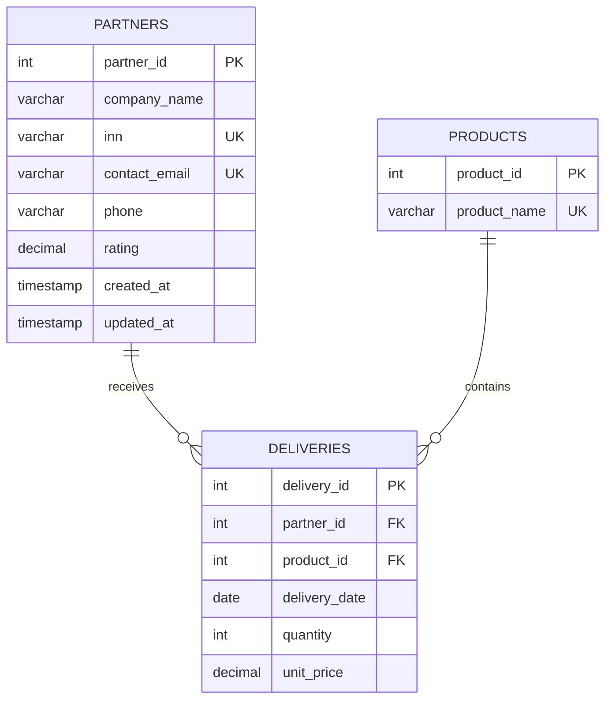

# 1. Проектирование базы данных (3NF) и ER-диаграмма

## Бизнес-требования

База данных должна обеспечивать:

1. просмотр списка партнеров;
2. редактирование данных партнеров;
3. вывод истории отгрузок партнеров.

Для выполнения требований выделены три сущности: `partners`, `products`, `deliveries`.

## Сущность `partners`

Хранит данные партнеров.

| Поле | Тип | Ограничения | Назначение |
|---|---|---|---|
| `partner_id` | INTEGER | PK | Идентификатор партнера |
| `company_name` | VARCHAR(150) | NOT NULL | Название партнера |
| `inn` | VARCHAR(12) | NOT NULL, UNIQUE | ИНН |
| `contact_email` | VARCHAR(120) | NOT NULL, UNIQUE | Email |
| `phone` | VARCHAR(20) |  | Телефон |
| `rating` | DECIMAL(2,1) | CHECK 0..5 | Рейтинг |
| `created_at` | TIMESTAMP | NOT NULL | Дата создания записи |
| `updated_at` | TIMESTAMP | NOT NULL | Дата последнего изменения |

## Сущность `products`

Справочник товаров.

| Поле | Тип | Ограничения | Назначение |
|---|---|---|---|
| `product_id` | INTEGER | PK | Идентификатор товара |
| `product_name` | VARCHAR(150) | NOT NULL, UNIQUE | Название товара |

## Сущность `deliveries`

Хранит историю реализации/отгрузок.

| Поле | Тип | Ограничения | Назначение |
|---|---|---|---|
| `delivery_id` | INTEGER | PK | Идентификатор отгрузки |
| `partner_id` | INTEGER | NOT NULL, FK | Партнер |
| `product_id` | INTEGER | NOT NULL, FK | Товар |
| `delivery_date` | DATE | NOT NULL | Дата отгрузки |
| `quantity` | INTEGER | NOT NULL, CHECK > 0 | Количество, шт. |
| `unit_price` | DECIMAL(12,4) | NOT NULL, CHECK >= 0 | Цена одной единицы |

Итоговая сумма поставки не хранится отдельным полем и вычисляется как:

```text
quantity * unit_price
```

Это исключает хранение вычисляемого значения, которое можно однозначно получить из других атрибутов.

## Связи

- `partners (1) -> (N) deliveries`;
- `products (1) -> (N) deliveries`.

## ER-диаграмма



## Обоснование 3NF

### Первая нормальная форма (1NF)

Каждое поле содержит одно атомарное значение. Товары, даты и количества не объединяются в списки внутри одной ячейки.

### Вторая нормальная форма (2NF)

Все таблицы имеют простые первичные ключи. Каждый неключевой атрибут полностью зависит от первичного ключа своей таблицы.

Примеры функциональных зависимостей:

```text
partner_id -> company_name, inn, contact_email, phone, rating
product_id -> product_name
delivery_id -> partner_id, product_id, delivery_date, quantity, unit_price
```

### Третья нормальная форма (3NF)

Транзитивные зависимости отсутствуют:

- название партнера не хранится в `deliveries`, вместо него используется `partner_id`;
- название товара не хранится в `deliveries`, вместо него используется `product_id`;
- итоговая сумма не дублируется, а вычисляется из `quantity` и `unit_price`.

Таким образом, справочные данные партнеров и товаров не дублируются в истории отгрузок.

## Соглашение об именовании

Во всем проекте используется единый стиль:

- таблицы — множественное число;
- имена — `snake_case`;
- первичные ключи — `<entity>_id`;
- внешние ключи имеют те же имена, что и соответствующие первичные ключи.
